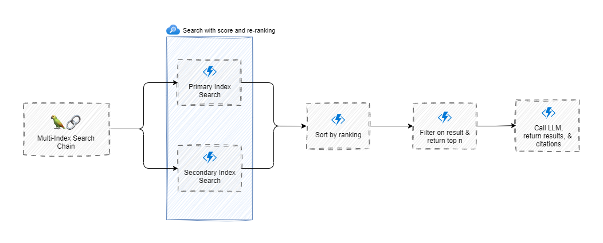
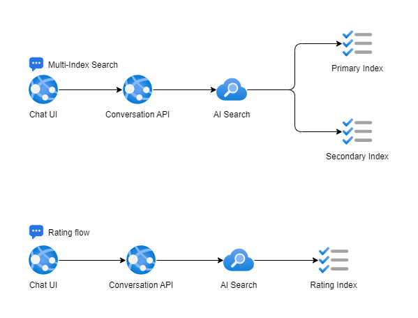
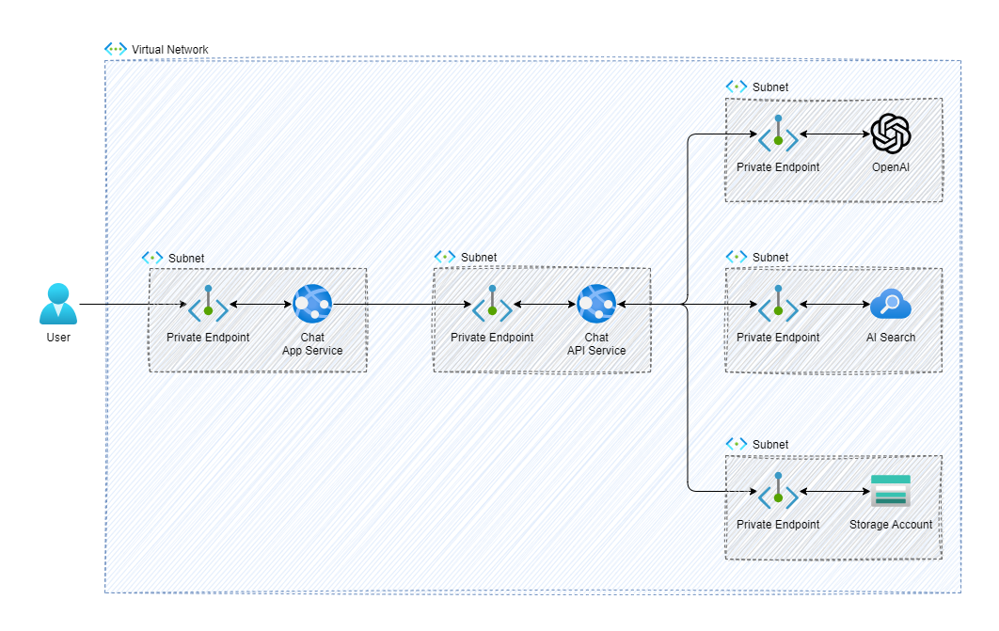

# Project

### Multi-Index Search Flow

When trying to retrieve documents and information to add to an LLM's context, they can be stored in multiple locations. In this example, we search two indexes in AI Search and utilize scoring as well as semantic ranking to retrieve the highest-rated information possible. When searching against a vector store such as AI Search, a hybrid search is recommended to increase the chances of finding information that will help set context. Typically, this will lower the overall RRF score, causing the results to be weighted differently than a semantic search. This is where re-ranking can help. By re-ranking the values and sorting them, you can evaluate the results and pull the topmost documents based on your data.

### Direct Preference Optimization

Since we are using re-ranking and answers can potentially be in either index, we implemented a pattern called [direct preference optimization](https://arxiv.org/abs/2305.18290) which can help add additional context for both positive and negative responses provided by the LLM. This data can be added to the context with notations on whether this is a good response or a bad response and help provide better responses. Additionally, the data can be searched and ranked to potentially avoid the LLM if the prompt has a high enough ranking.

In the user interface, when a response is returned, there is a thumbs up and thumbs down button provided to the user. They can rate the response, which will then be stored in AI Search. The prompt will be stored as text and vectorized, and the response will be stored as well.

### Citations

When searching for data, both internally within your company and externally, it is important to provide citations to the user so they can identify the source of the information. During the index search, documents are added to the chain, formatted, and the system prompt is used to tell the LLM to utilize the provided context to cite the answers provided. The LLM responds back with an answer in a format that can be parsed, allowing for a user to click on the link and view the cited document.

## Architecture

1. Virtual Network - Single virtual network for all the resource.
2. Storage Account - Utilized to drop documents and trigger an Azure function to chunk the document and store in AI Search.
3. Chat App Service - Hosts the chat application for DSL based questions
4. Chat API Service - Hosts the chat application for DSL based questions
5. AI Search - Used as a vector database and for semantic searching across indexes of chunked data.

## Code Description
### Backend
The backend was built using Python and utilizes FastAPI for creating routes to accept traffic. We use Langchain to search multiple indexes of data within the same AI Search. Langchain allows us to conduct parallel searches and then join the information back together, sorting and filtering the data as needed. In the current implementation, we are utilizing a managed identity[^1] and generating SAS tokens to display the documents that are cited in the response.

[^1]: Since the sas token is generated from the API, the managed identity must have the Storage Blob Delegator role to view documents.

### Frontend
The frontend application is a clone from the [Enterprise Samples](https://github.com/Azure-Samples/openai/tree/main/End_to_end_Solutions/AOAISearchDemo/app/frontend) and we have removed some of the features for user profile and history to focus solely on the chat features. This is a React application that calls the backend API using the vite proxy, which is loaded alongside the application on the vite server.

## Next Steps
1. Utilize the the ratings to help add additional context to the prompt for high and low quality responses as well as potentially bypass the LLM.
2. Implement guardrails to ensure the LLM responses are on track and have not deviated from the intent.
3. Utilize the guidance library for optimizing token usage since we are implementing RAG and passing in documents to the context. 
4. Add prompty for prompt engineering and semantic evaluation.
5. Implement ground truth testing to validate the responses that are coming back from the multi-index search are accurate.
6. Add user history to the request so users can ask questions on data that was previously returned.

## Contributing

This project welcomes contributions and suggestions.  Most contributions require you to agree to a
Contributor License Agreement (CLA) declaring that you have the right to, and actually do, grant us
the rights to use your contribution. For details, visit https://cla.opensource.microsoft.com.

When you submit a pull request, a CLA bot will automatically determine whether you need to provide
a CLA and decorate the PR appropriately (e.g., status check, comment). Simply follow the instructions
provided by the bot. You will only need to do this once across all repos using our CLA.

This project has adopted the [Microsoft Open Source Code of Conduct](https://opensource.microsoft.com/codeofconduct/).
For more information see the [Code of Conduct FAQ](https://opensource.microsoft.com/codeofconduct/faq/) or
contact [opencode@microsoft.com](mailto:opencode@microsoft.com) with any additional questions or comments.

## Trademarks

This project may contain trademarks or logos for projects, products, or services. Authorized use of Microsoft 
trademarks or logos is subject to and must follow 
[Microsoft's Trademark & Brand Guidelines](https://www.microsoft.com/en-us/legal/intellectualproperty/trademarks/usage/general).
Use of Microsoft trademarks or logos in modified versions of this project must not cause confusion or imply Microsoft sponsorship.
Any use of third-party trademarks or logos are subject to those third-party's policies.

